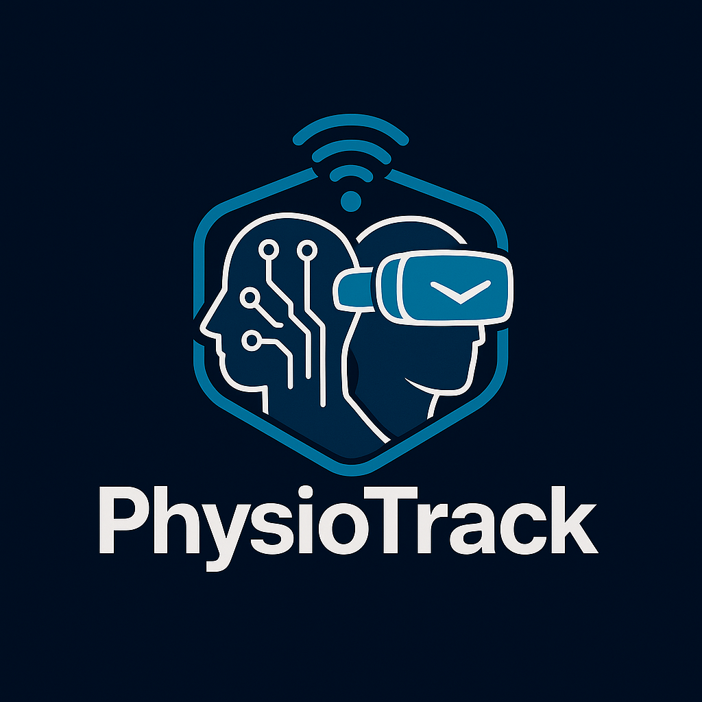

# PhysioTrack: An Intelligent AI and IoT System for Smart Physical Rehabilitation



[](#)
[](#)
[](#)
[](#)
[](#)
[](#)
[](#)
[](#)
[](#)
[](#)
[](#)

---

##  Abstract

Physical rehabilitation is essential for restoring mobility and improving the quality of life after knee injuries. However, patient adherence remains a major challenge due to monotony, lack of motivation, and absence of real-time corrective feedback.

**PhysioTrack** is an intelligent system that integrates **AI**, **IoT sensors**, and **Virtual Reality (VR)** to transform rehabilitation into an interactive, adaptive, and data-driven process.

The system uses IMU and pressure sensors to capture real-time motion data, which is processed by an ONNX-converted MLP model running on the edge. VR gamification provides audiovisual guidance and boosts patient motivation.

Experimental results show:
- **96.2% accuracy** in squat classification  
- **80% improvement in user satisfaction** vs traditional methods  

This study demonstrates the potential of AI-driven, home-based physiotherapy systems to enhance accessibility, engagement, and recovery outcomes.

---

##  Key Features
- Real-time motion tracking via **IMU + FSR sensors**  
- **AI-powered feedback** for exercise correction  
- **Virtual Reality coach** in an interactive 3D environment  
- Gamified avatar customization system  
- Performance tracking and progress reports  
- Designed for both patients & physiotherapists  

---

##  Methods & Materials

### Hardware Components
- **MPU-6050** (Accelerometer + Gyroscope)  
- **FSR-402** (Force Sensor)  
- **Raspberry Pi**  
- Display Screen  
- Laptop/PC (Unity + AI Development)

### Software Stack
- AI Motion Analysis (TensorFlow / PyTorch → ONNX)  
- Unity VR Environment + Oculus Integration  
- Real-time feedback system  
- Gamification mechanics  

### System Pipeline  
.png)

---

##  Experimental Results

### Confusion Matrix  


### Feature Heatmap  


### ROC Curve  


---

##  VR Scenes & Visualization

### VR Scene Samples
  
  


---

##  Future Work
- Personalized rehab plans  
- Advanced VR interaction  
- Full-body motion tracking  
- AI-driven smart virtual trainer  

---

## 📚 Citation

If you use **PhysioTrack** in your research, please cite:

```
Ahmed Talaat Mersal, Awab Mostafa, Salsabil Mostafa, Farha Farghaly, Arwa Eisa.
PhysioTrack: An Intelligent AI and IoT System for Smart Physical Rehabilitation.
TechRxiv, 2025.
DOI: 10.36227/techrxiv.176238015.59132608/v1
```

---
