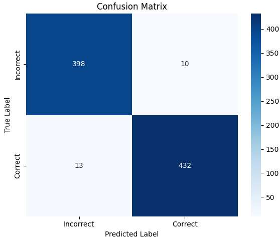
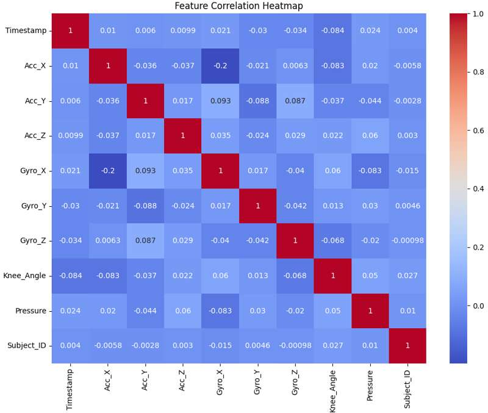
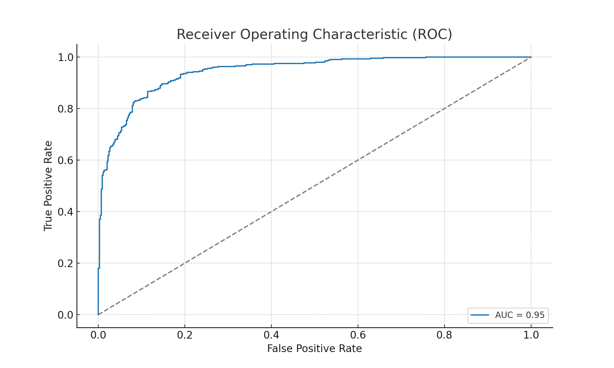
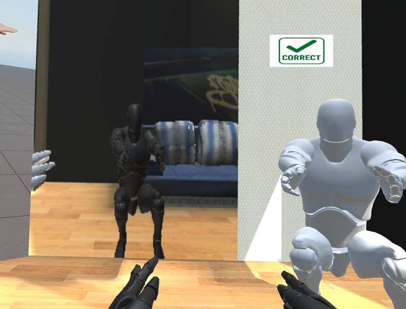
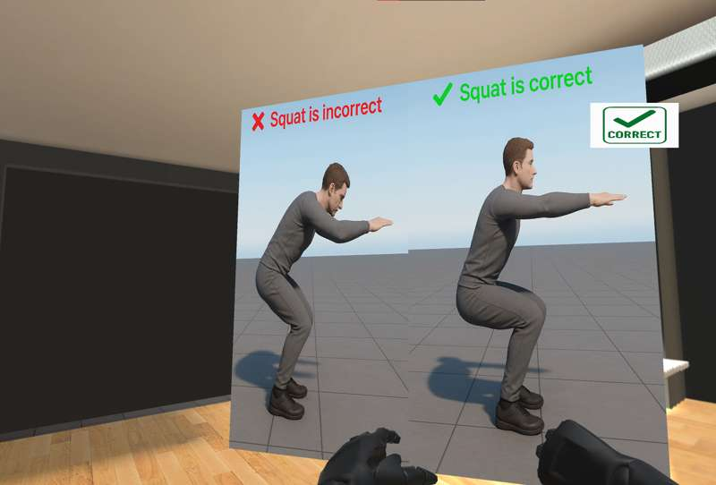
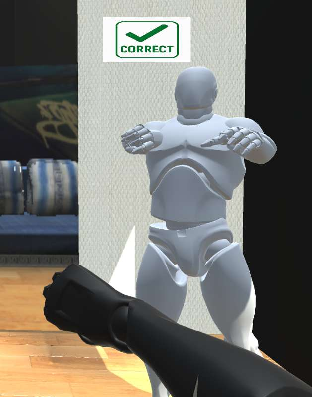

# 🏋️‍♂️🤖 PhysioTrack: AI & IoT for Smart Rehabilitation

**Team:** PhysioTrack Team  

---

# ⚙️ Technologies Used
This project leverages a combination of **hardware, software, and AI frameworks** to deliver a fully integrated physiotherapy solution.

[](#)
[](#)
[](#)
[](#)
[](#)
[](#)
[](#)
[](#)

---

# 📄 License
This project is licensed under the **MIT License** – feel free to use, modify, and distribute this work with proper attribution.

---

## 📌 Abstract
PhysioTrack is an intelligent, integrated system designed to improve the home rehabilitation experience for knee injury patients through accurate monitoring, interactivity, and motivation. Statistics show that nearly 50% of patients struggle with adhering to home exercise routines, and over 70% of knee injuries require consistent physiotherapy. Additionally, more than 60% of patients face psychological challenges such as anxiety or depression during recovery.  

The system uses IMU and pressure sensors to track movements in real time, with AI providing instant audio feedback for correction. Through virtual reality, patients engage with a virtual trainer in a gym-like environment. To boost motivation and mental well-being, users earn points to customize a virtual character, making therapy both effective and engaging.

---

## 🎯 Key Features
- Real-time motion tracking using **IMU & pressure sensors**  
- **AI-powered feedback** for accurate exercise correction  
- **Virtual Reality trainer** in an interactive 3D environment  
- Gamified reward system (points & avatar customization)  
- Progress tracking with performance reports  
- Designed for both patients and physiotherapists  

---

## 🛠️ Methods & Materials
### Hardware Components
- MPU-6050 (Accelerometer + Gyroscope)  
- FSR-402 (Force Sensitive Resistor)  
- Raspberry Pi  
- Display Screen  
- Development Laptop/PC  

### Software Components
- AI Algorithms for movement analysis  
- VR Environment (Unity & Oculus)  
- 3D Virtual Trainer  
- Reward Points System
- **pipeline**  
  .png)

---

## 📊 Results
Our ONNX-based squat detection model achieved:  
- **96% accuracy** in exercise tracking  
- **80% increase** in user satisfaction due to VR + AI integration  
- High patient engagement and improved psychological well-being  

- **Confusion Matrix**  
  

- **Feature Heatmap**  
  

- **Receiver Operating Characteristic**  
  

---

## 🥽 GUI & Visualization
The system integrates a **virtual coach (3D character)** inside the VR environment.  
This coach demonstrates each exercise step-by-step, helping patients visually understand how to perform movements correctly.  

To further support learning, **illustrative diagrams** are displayed for each exercise, allowing patients to compare the correct vs. incorrect posture.  

By connecting the **ONNX-trained model** to the main character, which was trained on real squat exercise videos, the system is able to:  
- Provide **instant feedback** (audio/visual) on whether the patient is performing the movement correctly.  
- Highlight the **accuracy percentage** of the performed exercise in real time.

- **vr_scene1**  
  

- **vr_scene2**  
  

- **vr_scene3**  
  

---

## 🚀 Recommendations

- Expand injury database (knee, shoulder, spine, ankle).

- Collaborate with physiotherapists for personalized plans.

- Partner with clinics and hospitals for integration.

- Add chatbot/virtual assistant for live guidance.

- Improve UI/UX based on patient feedback.

- Offer device versions for different age groups.

- Build a community feature for progress sharing.

---

## 💼 Business Model Canvas

- Key Partners: Physiotherapy centers, hospitals, sensor tech companies, cloud providers.

- Value Proposition: Smart, interactive, safe, and motivational physiotherapy at home.

- Customer Segments: Knee injury patients (18–50), rehabilitation clinics, medical institutions.

- Revenue Streams: Device sales, monthly subscriptions, loyalty incentives.

---

## 📈 Cost & Revenue Model

- Cost per product: ~EGP 3500

- Selling price: ~EGP 4400 (+20% margin)

- Monthly profit (15 devices): ~EGP 13,500

- Annual profit: ~EGP 162,000

- Subscription revenue: ~EGP 27,000 yearly

---

## 🔮 Future Work

- Personalized treatment plans

- AI-powered smart virtual trainer

- Advanced VR interaction

- Multi-injury rehabilitation support

---

## 📚 References

Alalou, Dr. Samar Sassi (2024). Difficulties faced by the patient for not adhering to his treatment sessions in physiotherapy centers.

Ali, M. (n.d.). The chaos of physiotherapy in Egypt.

Harvard Health. Health information and medical information.

TigaHealth. Mobithera - Physical Therapy and Telemedicine App.

Physiapp. VisiApp®: Personalized Physical Therapy and Telehealth Platform.

---

## 🔧 Python Dependencies
```Python Libraries
# Core scientific libraries
numpy
pandas
scipy
scikit-learn

# Deep learning frameworks
tensorflow
torch
torchvision

# ONNX model support
onnx
onnxruntime

# Computer vision
opencv-python
mediapipe

# Visualization & data analysis
matplotlib
seaborn
notebook

# Hardware / IoT communication
pyserial
smbus2   # for I2C sensors on Raspberry Pi
RPi.GPIO # if using Raspberry Pi GPIO pins

# Game engine / VR interaction (Python side)
pygame
```

---

## Unity Dependencies
- Unity 2022.3

- Unity Barracuda package (ONNX inference inside Unity)

- Oculus/VR Integration package

---

## 🙏 Acknowledgement
We would like to express our gratitude to our academic mentors and advisors who provided valuable guidance and support throughout the development of this project.
Special thanks to our instructors and colleagues who encouraged us and contributed with their feedback during different phases of the work.
